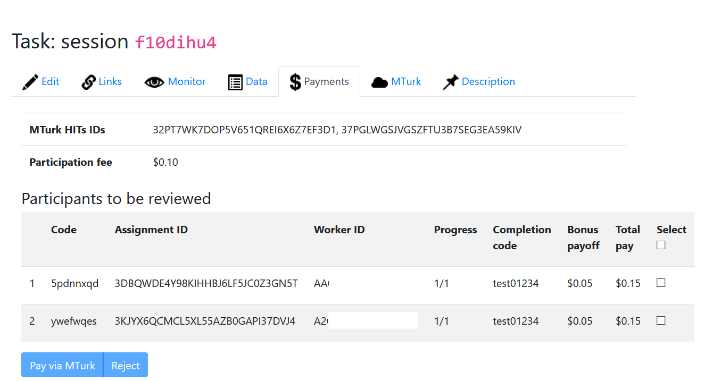

Modified core libraries of oTree 3.6.6 to allow hyper-batching
when publishing HITs on Amazon Mechanical Turk.
This allows for a 50% reduction of Amazon fees (from 40% to 20%)
on any payment sent to workers for HITs with more than 9 assignments.

Hyper-batching is implemented by publishing simultaneously multiple HITs
with maximum 9 assignments per HIT until reaching the total number of
assignments requested by the researcher when creating an oTree session.
(Note: an assignment equals one participant who completed a study
in an oTree session.)

Usage Instructions
------------------

The ``requirements.txt`` of an oTree project should point to this
repository to install oTree by substituting:

``otree[mturk]>=your_otree_version``

with

``git+https://github.com/furuneko/otree-core.git@stable#egg=otree[mturk]``

Preview
-------
When creating an oTree session for MTurk, oTree will automatically implement
hyper-batching. The only noticeable difference on the oTree admin interface
is in the "Payments" tab, where multiple HITs IDs will be displayed, as
shown here:

